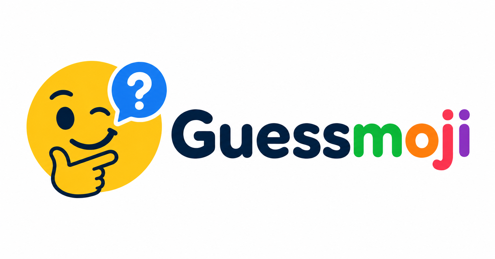

# Guessmoji



Guessmoji is a fast emoji Pictionary game for browsers. Pick a themed category,
show a big emoji clue, let the group guess, then reveal the answer, hint, details,
and fun fact.

Guessmoji includes classroom-friendly themed packs, large projector-readable clues,
host controls, local-only preferences, static puzzle data, and a Docker image for
self-hosting. The MVP runs without login, accounts, multiplayer, Redis, Postgres,
or any database.

## Table of Contents

- [How It Works](#how-it-works)
- [Features](#features)
- [Requirements](#requirements)
- [Install and Run Locally](#install-and-run-locally)
- [Controls](#controls)
- [Category Discovery](#category-discovery)
- [Puzzle Data](#puzzle-data)
- [Run the Checks](#run-the-checks)
- [Docker Compose](#docker-compose)
- [Use a Published GHCR Image](#use-a-published-ghcr-image)
- [Reverse Proxy and HTTPS](#reverse-proxy-and-https)
- [Run on Unraid](#run-on-unraid)
- [Social Preview Metadata](#social-preview-metadata)
- [Troubleshooting](#troubleshooting)
- [Security Notes](#security-notes)
- [Project Structure](#project-structure)
- [Unofficial Content Notice](#unofficial-content-notice)

## How It Works

1. Pick a category.
2. Show the emoji clue on a shared screen.
3. Let players guess the answer.
4. Use the hint when the group needs a nudge.
5. Reveal the answer, details, and fun fact.
6. Move to the next card until the category is complete.

Answers stay hidden until the host reveals them. The game is designed for quick
rounds, projector use, smartboards, Chromebooks, tablets, and phones.

## Features

- 60 themed categories with 600 total puzzles.
- Classroom-friendly packs for movies, characters, shows, games, school topics,
  animals, science, landmarks, holidays, idioms, emotions, and more.
- Random Mix mode built from the broader safe puzzle pool.
- Large emoji clue card for shared-screen play.
- Hint, reveal, hide answer, next, previous, shuffle, restart, fullscreen, and timer
  controls.
- Settings dialog for secondary controls.
- Completion screen with replay and category navigation.
- Fresh shuffled card order each time a category starts, plus on-demand reshuffle.
- Local browser preferences for last category and timer length.
- Static TypeScript seed data with no database requirement.
- Open Graph, Twitter, Discord, and Facebook-friendly preview image.
- Dockerfile, Docker Compose, and GitHub Actions workflow for GHCR publishing.

## Requirements

For local development:

- Node.js 22
- npm

For container deployment:

- Docker with Compose support

No external services are required for the MVP.

## Install and Run Locally

Clone the repository and install dependencies:

```bash
git clone https://github.com/<github-owner>/guessmoji.git
cd guessmoji
npm install
npm run dev
```

Open the local development URL:

```txt
http://localhost:3000
```

To preview a production build locally:

```bash
npm run build
npm start
```

## Controls

### Host Controls

- Hint: show a pre-reveal clue.
- Reveal Answer: show the answer, details, explanation, and fun fact.
- Hide Answer: return the card to guessing mode.
- Next and Previous: move through the current category.
- Restart: return to the first card.
- Shuffle: randomize the current category order.
- Fullscreen: use the browser fullscreen API when available.

### Keyboard

| Key | Action |
| --- | --- |
| `Space` | Reveal or hide the answer |
| `H` | Show hint |
| `Right Arrow` | Next puzzle |
| `Left Arrow` | Previous puzzle |
| `S` | Shuffle |
| `R` | Restart |

## Category Discovery

Use the category browser to choose a pack by theme. Current categories include Disney
Movies, Disney Princesses, Pixar, Marvel, Star Wars, DreamWorks, Video Game Movies,
Kid TV Shows, Animated Classics, Animals, Ocean Animals, Dinosaurs, Sports, Board
Games, Video Games, Pokemon, Minecraft, Science, Space, Weather, Math, Books and
Stories, Fairy Tales, Landmarks, Geography, Vehicles, Jobs, Music, Art Supplies,
School Supplies, Holidays, Literal Phrases, Idioms, Emotions, Robots, Plants, and
Random Mix.

Random Mix pulls from multiple safe categories and avoids duplicate puzzle IDs in the
generated play set.

## Puzzle Data

Puzzle data lives in TypeScript files under `src/data` and `src/lib`.

Each puzzle can include:

- Answer
- Emoji clue
- Category
- Difficulty
- Hint
- Details
- Explanation
- Fun fact
- Tags

The MVP seed set is static and checked into the repository. This keeps setup simple,
portable, and database-free.

## Run the Checks

Run the standard verification commands:

```bash
npm run lint
npm run typecheck
npm run test
npm run build
```

The Docker publishing workflow runs the same checks before building and publishing the
container image.

## Docker Compose

The included `docker-compose.yml` runs Guessmoji from a GHCR image:

```bash
docker compose up -d
docker compose ps
```

The app listens on container port `3000`. Override the host port with `APP_PORT`:

```env
APP_PORT=3000
NEXT_PUBLIC_APP_NAME="Guessmoji"
NEXT_PUBLIC_APP_URL="http://localhost:3000"
```

To build locally instead of pulling an image, uncomment the `build` block in
`docker-compose.yml`.

## Use a Published GHCR Image

Published image format:

```txt
ghcr.io/<github-owner>/guessmoji:latest
```

Example Compose image line:

```yaml
image: ghcr.io/<github-owner>/guessmoji:latest
```

If you fork the project, update your workflow and Compose image owner to match your
repository or package namespace.

## Reverse Proxy and HTTPS

Guessmoji works behind common reverse proxies such as NGINX Proxy Manager, SWAG,
Traefik, Caddy, and Cloudflare Tunnel.

Typical proxy settings:

- Forward hostname: the container host or Docker service name.
- Forward port: `3000`.
- Public URL: set `NEXT_PUBLIC_APP_URL` to your public HTTPS URL.
- WebSocket support: not required for the MVP.

HTTPS is recommended for public deployments and for clean social preview metadata.

## Run on Unraid

Guessmoji can run on Unraid as a single Docker Compose stack. No database, cache,
login service, or mounted storage is required.

Example stack:

```yaml
services:
  guessmoji:
    image: ghcr.io/<github-owner>/guessmoji:latest
    container_name: guessmoji
    restart: unless-stopped
    ports:
      - "3000:3000"
    environment:
      NODE_ENV: production
      NEXT_PUBLIC_APP_NAME: "Guessmoji"
      NEXT_PUBLIC_APP_URL: "https://guessmoji.example.com"
```

Unraid notes:

- Use any open host port if `3000` is already taken.
- Point your reverse proxy to the chosen host port or to container port `3000`.
- Set `NEXT_PUBLIC_APP_URL` to the public URL for your deployment.
- Keep `.env` limited to safe public values unless you intentionally add secrets later.

## Social Preview Metadata

The app uses local assets for social previews and install metadata:

- Preview image: `public/assets/guessmoji-embed.png`
- Logo: `public/assets/guessmoji-logo.png`
- Web manifest: `public/site.webmanifest`
- Favicons: files in `public/`

Update `NEXT_PUBLIC_APP_URL` before building a production image so Open Graph and
Twitter metadata resolve against the correct deployment URL.

## Troubleshooting

If the app does not start:

- Confirm dependencies are installed with `npm install`.
- Confirm port `3000` is available or set `APP_PORT`.
- Run `npm run typecheck` and `npm run build` to catch configuration issues.

If a GHCR image cannot be pulled:

- Confirm the package exists.
- Confirm the package visibility is public, or authenticate Docker for private packages.
- Confirm the image owner in Compose matches the package owner.

If social previews show stale images:

- Confirm `NEXT_PUBLIC_APP_URL` points to the public deployment.
- Confirm the preview image is reachable at `/assets/guessmoji-embed.png`.
- Re-scrape the URL in the target platform's preview tool.

## Security Notes

- Do not commit real secrets.
- The provided `.env` values are safe starter defaults.
- The MVP stores only non-sensitive browser preferences locally.
- There are no accounts, server-side user records, or database credentials in the MVP.

## Project Structure

```txt
.
├── AGENTS.md
├── README.md
├── TASKS.md
├── UPDATES.md
├── docker-compose.yml
├── public/
│   ├── assets/
│   └── site.webmanifest
└── src/
    ├── app/
    ├── components/
    ├── data/
    ├── lib/
    ├── styles/
    └── types/
```

## Unofficial Content Notice

Guessmoji is an unofficial fan-made game and is not affiliated with featured
brands, studios, publishers, platforms, or rightsholders. Emoji clues are used as
transformative guessing prompts for casual group play.
