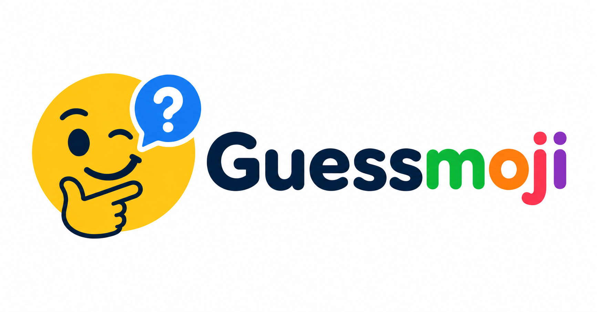

# Guessmoji



Guessmoji is a fast emoji Pictionary game for browsers. Pick a themed category,
show a big emoji clue, let the group guess, then reveal the answer, hint, details,
and fun fact.

Guessmoji includes classroom-friendly themed packs, large projector-readable clues,
host controls, local-only preferences, static puzzle data, and a Docker image for
self-hosting. The MVP runs without login, accounts, multiplayer, Redis, Postgres,
or any database.

## Table of Contents

- [How It Works](#how-it-works)
- [Features](#features)
- [Requirements](#requirements)
- [Install and Run Locally](#install-and-run-locally)
- [Controls](#controls)
- [Category Discovery](#category-discovery)
- [Puzzle Data](#puzzle-data)
- [Run the Checks](#run-the-checks)
- [Docker Compose](#docker-compose)
- [Use a Published GHCR Image](#use-a-published-ghcr-image)
- [Reverse Proxy and HTTPS](#reverse-proxy-and-https)
- [Run on Unraid](#run-on-unraid)
- [Social Preview Metadata](#social-preview-metadata)
- [Troubleshooting](#troubleshooting)
- [Security Notes](#security-notes)
- [Project Structure](#project-structure)
- [Unofficial Content Notice](#unofficial-content-notice)

## How It Works

1. Pick a category.
2. Show the emoji clue on a shared screen.
3. Let players guess the answer.
4. Use the hint when the group needs a nudge.
5. Reveal the answer, details, and fun fact.
6. Move to the next card until the category is complete.

Answers stay hidden until the host reveals them. The game is designed for quick
rounds, projector use, smartboards, Chromebooks, tablets, and phones.

## Features

- 60 source categories with 730 source puzzles, plus the derived Random Mix option
  (61 category choices total).
- Classroom-friendly packs for movies, characters, shows, games, school topics,
  animals, science, landmarks, holidays, idioms, emotions, and more.
- Random Mix mode built from a 719-card pool deduplicated by normalized answer.
- Large emoji clue card for shared-screen play.
- Hint, reveal, hide answer, next, previous, shuffle, restart, fullscreen, and timer
  controls.
- Settings dialog for secondary controls.
- Completion screen with replay and category navigation.
- Ten-card source rounds that prefer unseen cards and cycle deterministically after
  the category pool is exhausted.
- Ten-card Random Mix sessions with source-category metadata shown only after reveal.
- Fresh shuffled card order each time a category starts, plus on-demand reshuffle
  without consuming another round.
- Local browser preferences for last category and timer length.
- Per-category round history stored safely in local browser storage; timer changes and
  restart do not consume another round.
- Static TypeScript seed data with no database requirement.
- Open Graph, Twitter, Discord, and Facebook-friendly preview image.
- Dockerfile, Docker Compose, and GitHub Actions workflow for GHCR publishing.

## Requirements

For local development:

- Node.js 22
- npm

For container deployment:

- Docker with Compose support

No external services are required for the MVP.

## Install and Run Locally

Clone the repository and install dependencies:

```bash
git clone https://github.com/<github-owner>/guessmoji.git
cd guessmoji
npm install
npm run dev
```

Open the local development URL:

```txt
http://localhost:3000
```

To preview a production build locally:

```bash
npm run build
npm start
```

## Controls

### Host Controls

- Hint: show a pre-reveal clue.
- Reveal Answer: show the answer, details, and fun fact.
- Hide Answer: return the card to guessing mode.
- Next and Previous: move through the current category.
- Restart: return to the first card.
- Shuffle: randomize the current category order.
- Fullscreen: use the browser fullscreen API when available.

### Keyboard

| Key | Action |
| --- | --- |
| `Space` | Reveal or hide the answer |
| `H` | Show hint |
| `Right Arrow` | Next puzzle |
| `Left Arrow` | Previous puzzle |
| `S` | Shuffle |
| `R` | Restart |
| `F` | Fullscreen |
| `Escape` | Close overlays, then hide visible hint or answer |

## Category Discovery

Use the category browser to choose a pack by theme. The current 60 source categories
are Disney Movies, Disney Princesses, Pixar, Marvel, Star Wars, DreamWorks, Video
Game Movies, Kid TV Shows, Animated Classics, Animals, Ocean Animals, Dinosaurs,
Birds, Insects and Bugs, Fruit, Vegetables, Desserts, Snacks, Breakfast, Sports,
Outdoor Games, Board Games, Card and Party Games, Video Games, Arcade Classics,
Pokemon, Minecraft, Science, Space, Weather, Math, Books and Stories, Fairy Tales,
Myths and Legends, World Landmarks, U.S. Landmarks, World Geography, Vehicles,
Construction & Building, Jobs, Musical Instruments, Music Genres, Art Supplies,
School Supplies, Camping, National Parks, Holidays, Halloween, Winter Holidays,
Summer Fun, Beach Day, Amusement Park, Around the House, Kitchen Tools, Literal
Phrases, Idioms, Emotions, Robots, Plants, and Harry Potter. Random Mix is the
61st derived category choice.

Every source category has at least one complete ten-card block; Harry Potter has 20
cards. Random Mix pulls from the safe source pool, keeps the first occurrence of each
normalized answer, and starts a ten-card session without revealing a card's source
category until the answer is revealed.

## Puzzle Data

Puzzle data lives in TypeScript files under `src/data` and `src/lib`.

Each puzzle can include:

- Answer
- Emoji clue
- Category
- Difficulty
- Hint
- Details
- Explanation
- Fun fact
- Tags

The MVP seed set is static and checked into the repository: 730 source cards across
60 source categories. This keeps setup simple, portable, and database-free.

## Run the Checks

Run the standard verification commands:

```bash
npm run lint
npm run typecheck
npm run test
npm run build
```

The Docker publishing workflow installs dependencies, runs lint, typecheck, and tests,
then builds and publishes the container image.

## Docker Compose

The included `docker-compose.yml` runs Guessmoji from a GHCR image:

```bash
docker compose up -d
docker compose ps
```

The app listens on container port `3000`. Override the host port with `APP_PORT`:

```env
APP_PORT=3000
NEXT_PUBLIC_APP_NAME="Guessmoji"
NEXT_PUBLIC_APP_URL="http://localhost:3000"
```

The URL used for Open Graph and Twitter metadata is baked into an image during its
build. Runtime `NEXT_PUBLIC_APP_URL` keeps container configuration consistent, but it
does not rewrite metadata in an already-built image. To build a local production image
for a deployment URL, pass the build argument explicitly:

```bash
docker build --build-arg NEXT_PUBLIC_APP_URL=https://guessmoji.example.com -t guessmoji:local .
```

To build with Compose instead of pulling an image, uncomment the `build` block in
`docker-compose.yml`; its commented `args` entry passes the value from `.env` to the
Docker build.

To update an existing Compose deployment that uses the published image, pull the new
image and recreate the service:

```bash
docker compose pull
docker compose up -d --force-recreate
docker compose ps
```

The example Compose file tracks the convenient `latest` tag. For reproducible
deployments, replace it with an immutable commit-SHA or release tag before pulling.

## Use a Published GHCR Image

Published image format:

```txt
ghcr.io/<github-owner>/guessmoji:latest
```

Example Compose image line:

```yaml
image: ghcr.io/<github-owner>/guessmoji:latest
```

If you fork the project, update your workflow and Compose image owner to match your
repository or package namespace.

## Reverse Proxy and HTTPS

Guessmoji works behind common reverse proxies such as NGINX Proxy Manager, SWAG,
Traefik, Caddy, and Cloudflare Tunnel.

Typical proxy settings:

- Forward hostname: the container host or Docker service name.
- Forward port: `3000`.
- Public URL: build the image with `NEXT_PUBLIC_APP_URL` set to your public HTTPS URL.
- WebSocket support: not required for the MVP.

HTTPS is recommended for public deployments and for clean social preview metadata.

## Run on Unraid

Guessmoji can run on Unraid as a single Docker Compose stack. No database, cache,
login service, or mounted storage is required.

Example stack:

```yaml
services:
  guessmoji:
    image: ghcr.io/<github-owner>/guessmoji:latest
    container_name: guessmoji
    restart: unless-stopped
    ports:
      - "3000:3000"
    environment:
      NODE_ENV: production
      NEXT_PUBLIC_APP_NAME: "Guessmoji"
      NEXT_PUBLIC_APP_URL: "https://guessmoji.example.com"
```

Unraid notes:

- Use any open host port if `3000` is already taken.
- Point your reverse proxy to the chosen host port or to container port `3000`.
- When building your own production image, pass `NEXT_PUBLIC_APP_URL` as a Docker
  build argument set to the public URL. Production values must include the full
  `https://` scheme, such as `https://guessmoji.example.com`.
- A prebuilt GHCR image carries the metadata URL from its build; setting this variable
  only at container runtime cannot change that image's social preview tags.
- Keep `.env` limited to safe public values unless you intentionally add secrets later.

## Social Preview Metadata

The app uses local assets for social previews and install metadata:

- Preview image: `public/assets/guessmoji-embed.png`
- Logo: `public/assets/guessmoji-logo.png`
- Web manifest: `public/site.webmanifest`
- Favicons: files in `public/`

Pass `NEXT_PUBLIC_APP_URL` before building a production image so Open Graph and Twitter
metadata resolve against the correct deployment URL. Use an absolute URL with
`https://` for public deployments. A prebuilt image must be rebuilt and republished if
its metadata URL needs to change.

## Troubleshooting

If the app does not start:

- Confirm dependencies are installed with `npm install`.
- Confirm port `3000` is available or set `APP_PORT`.
- Run `npm run typecheck` and `npm run build` to catch configuration issues.

If a GHCR image cannot be pulled:

- Confirm the package exists.
- Confirm the package visibility is public, or authenticate Docker for private packages.
- Confirm the image owner in Compose matches the package owner.

If social previews show stale images:

- Confirm `NEXT_PUBLIC_APP_URL` points to the public deployment.
- Confirm the preview image is reachable at `/assets/guessmoji-embed.png`.
- Re-scrape the URL in the target platform's preview tool.

## Security Notes

- Do not commit real secrets.
- The provided `.env` values are safe starter defaults.
- The MVP stores only non-sensitive browser preferences locally.
- There are no accounts, server-side user records, or database credentials in the MVP.

## Project Structure

```txt
.
├── AGENTS.md
├── README.md
├── TASKS.md
├── UPDATES.md
├── docker-compose.yml
├── public/
│   ├── assets/
│   └── site.webmanifest
└── src/
    ├── app/
    ├── components/
    ├── data/
    ├── lib/
    ├── styles/
    └── types/
```

## Unofficial Content Notice

Guessmoji is an unofficial fan-made game and is not affiliated with featured
brands, studios, publishers, platforms, or rightsholders. Emoji clues are used as
transformative guessing prompts for casual group play.
